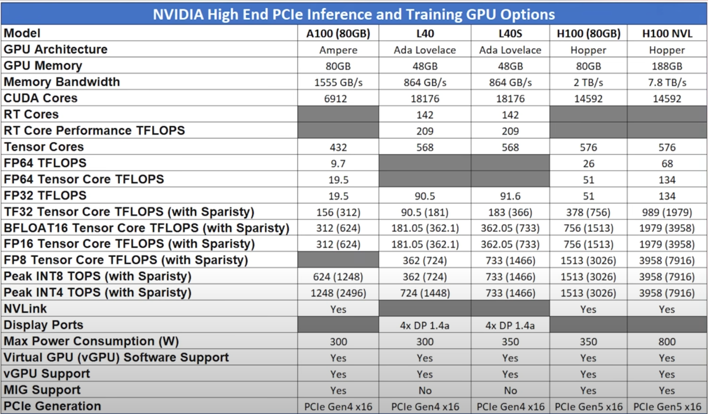

- ```
  apt update
  
  apt upgrade -y
  
  apt install tmux lshw pciutils usbutils inxi neovim htop btop nvtop ffmpeg -y
  
  touch ~/.tmux.conf
  
  vim .tmux.conf 
  set-option -g prefix C-a
  unbind C-b
  bind C-a send-prefix
  
  set-option -g base-index 1
  set-option -g pane-base-index 1
  ```
-
- ```
  # Update and upgrade system packages
  apt update
  apt upgrade -y
  
  # Install packages
  apt install tmux lshw pciutils usbutils inxi neovim htop btop nvtop ffmpeg jq -y
  
  # Create and edit tmux configuration file
  touch ~/.tmux.conf
  cat <<EOL > ~/.tmux.conf
  set-option -g prefix C-a
  unbind C-b
  bind C-a send-prefix
  set-option -g base-index 1
  set-option -g pane-base-index 1
  set -g status on
  set -q -g status-utf8 on
  setw -q -g utf8 on
  setw -g automatic-rename on
  set -g renumber-windows on
  unbind %
  bind = split-window -h
  bind - split-window -v
  set -g mouse  on
  EOL
  
  
  inxi -SCG
  lshw -short -class processor -class memory -class display
  
  # Clone the whisper.cpp repository and download model
  git clone https://github.com/ggerganov/whisper.cpp.git
  cd ~/whisper.cpp/
  bash ./models/download-ggml-model.sh large-v3-q5_0
  bash ./models/download-ggml-model.sh large-v3
  
  # Clean and build whisper.cpp with CUDA support
  make clean
  WHISPER_CUDA=1 make -j
  
  # Download and convert audio samples
  make samples
  CUDA_VISIBLE_DEVICES=0 ./main -m models/ggml-large-v3.bin -f samples/hp0.wav -pp -pc
  
  CUDA_VISIBLE_DEVICES=0
  
  # Run whisper.cpp on GPU 0 in the background
  CUDA_VISIBLE_DEVICES=0 ./main -m models/ggml-large-v3-q5_0.bin -f samples/diffusion2023-07-03.wav 
  
  # Run whisper.cpp on GPU 1 in the background
  CUDA_VISIBLE_DEVICES=1 ./main -m models/ggml-large-v3-q5_0.bin -f samples/diffusion2023-07-03.wav 
  
  # Install Ollama
  curl -fsSL https://ollama.com/install.sh | sh
  nohup ollama serve > ~/ollama/log 2>&1 &
  curl localhost:11434
  
  ollama pull dolphin-llama3
  ollama pull phi3
  ollama pull gemma
  ollama pull dolphin-mistral
  ollama pull dolphin-mixtral
  
  
  curl -X POST http://localhost:11434/api/generate -d '{
    "model": "dolphin-llama3",
    "prompt": "Why is the sky blue?"
  }'
  
  curl -X POST http://localhost:11434/api/generate -d '{
    "model": "dolphin-llama3",
    "prompt": "Why is the sky blue?",
    "stream": false,
    "options": {
      "temperature": 0.7
    }
  }'
  
  curl -X POST http://localhost:11434/api/chat -d '{
    "model": "dolphin-llama3",
    "messages": [
      { "role": "system", "content": "You are a helpful assistant." },
      { "role": "user", "content": "Hello!" }
    ]
  }'
  
  curl -X POST http://localhost:11434/api/chat -d '{
    "model": "dolphin-llama3",
    "messages": [
      { "role": "system", "content": "You are a helpful assistant." },
      { "role": "user", "content": "Hello!" }
    ]
  }' | jq -r '[.message.content] | join("")'
  
  curl -X POST http://localhost:11434/api/chat -d '{"model": "dolphin-llama3", "messages": [{"role": "system", "content": "You are a helpful assistant."}, {"role": "user", "content": "Hello!"}]}' | jq -r '.message.content' | tr -d '\n'
  
  كم يقدر هذا النموذج أن يقوم بشكل جيد؟
  このモデルはどれぐらい上手くいくと思いますか
  
  
  curl -X POST http://localhost:11434/api/chat -d '{
    "model": "dolphin-llama3",
    "messages": [
      {
        "role": "system",
        "content": "You are an advanced translation model specialized in translating text from various languages into English. Your goal is to accurately and fluently translate the provided text while maintaining the original meaning, tone, and context. Pay close attention to idiomatic expressions, cultural references, and specific terminologies to ensure a natural and coherent translation. When translating: 1. Preserve the original meaning and intent of the text. 2. Ensure grammatical correctness and natural flow in English. 3. Maintain the tone and style of the original content. 4. Handle idiomatic expressions and cultural references appropriately. 5. Clarify any ambiguities if necessary while remaining true to the source material."
      },
      {
        "role": "user",
        "content": " Translate كم يقدر هذا النموذج أن يقوم بشكل جيد؟"
      }
    ]
  }' | jq -r '[.message.content] | join("")'
  
  ```
-
- lshw -short -class processor -class memory -class display
-
- scp -P 20275 -i ~/.ssh/id_ed25519 /Users/mudrii/Downloads/samples root@66.114.112.70:/root/whisper.cpp/samples
-
- ## NVIDIA RTX 6000 Ada
- ### Server Specifications
-
- ```
  nvidia-smi
  Wed May 29 08:13:04 2024       
  +---------------------------------------------------------------------------------------+
  | NVIDIA-SMI 535.161.07             Driver Version: 535.161.07   CUDA Version: 12.2     |
  |-----------------------------------------+----------------------+----------------------+
  | GPU  Name                 Persistence-M | Bus-Id        Disp.A | Volatile Uncorr. ECC |
  | Fan  Temp   Perf          Pwr:Usage/Cap |         Memory-Usage | GPU-Util  Compute M. |
  |                                         |                      |               MIG M. |
  |=========================================+======================+======================|
  |   0  NVIDIA RTX 6000 Ada Gene...    On  | 00000000:61:00.0 Off |                  Off |
  | 30%   33C    P8              25W / 300W |      1MiB / 49140MiB |      0%      Default |
  |                                         |                      |                  N/A |
  +-----------------------------------------+----------------------+----------------------+
                                                                                           
  +---------------------------------------------------------------------------------------+
  | Processes:                                                                            |
  |  GPU   GI   CI        PID   Type   Process name                            GPU Memory |
  |        ID   ID                                                             Usage      |
  |=======================================================================================|
  |  No running processes found                                                           |
  +---------------------------------------------------------------------------------------+
  ```
-
- ```
  inxi -SCG
  System:
    Host: 3730c94e7089 Kernel: 5.15.0-101-generic x86_64 bits: 64 Console: pty pts/2
      Distro: Ubuntu 22.04.4 LTS (Jammy Jellyfish)
  CPU:
    Info: 2x 32-core model: AMD EPYC 75F3 bits: 64 type: MT MCP SMP cache: L2: 2x 16 MiB (32 MiB)
    Speed (MHz): avg: 1555 min/max: 1500/4042 cores: 1: 1500 2: 1500 3: 1500 4: 1500 5: 1500
      6: 1500 7: 1500 8: 1500 9: 1500 10: 1500 11: 1500 12: 1500 13: 1500 14: 1500 15: 3170 16: 1500
      17: 1500 18: 1500 19: 1500 20: 1500 21: 1500 22: 1500 23: 1500 24: 1500 25: 1500 26: 1500
      27: 1500 28: 1500 29: 1500 30: 1500 31: 1500 32: 1500 33: 1500 34: 1500 35: 1500 36: 1500
      37: 1500 38: 1500 39: 1500 40: 1500 41: 1500 42: 1500 43: 1500 44: 1500 45: 1500 46: 1500
      47: 1500 48: 1500 49: 1500 50: 1500 51: 1500 52: 1500 53: 1500 54: 1500 55: 1500 56: 1500
      57: 1500 58: 1500 59: 1500 60: 1500 61: 1500 62: 1500 63: 1500 64: 1500 65: 1500 66: 1500
      67: 1500 68: 1500 69: 1500 70: 1500 71: 1500 72: 1500 73: 1500 74: 1500 75: 1500 76: 1500
      77: 1500 78: 1500 79: 1500 80: 2950 81: 2950 82: 1500 83: 1500 84: 1500 85: 1500 86: 1500
      87: 1500 88: 1500 89: 1500 90: 1500 91: 1500 92: 1500 93: 1500 94: 1500 95: 1500 96: 1500
      97: 1500 98: 1500 99: 1500 100: 1500 101: 1500 102: 1500 103: 1500 104: 1500 105: 1500
      106: 1500 107: 1500 108: 1500 109: 1500 110: 1500 111: 1500 112: 1500 113: 1500 114: 1500
      115: 1500 116: 1500 117: 1500 118: 1500 119: 1500 120: 1500 121: 1500 122: 1500 123: 1500
      124: 1500 125: 1500 126: 1500 127: 1500 128: 4009
  Graphics:
    Device-1: NVIDIA driver: nvidia v: 535.161.07
    Device-2: NVIDIA driver: nvidia v: 535.161.07
    Device-3: NVIDIA driver: nvidia v: 535.161.07
    Device-4: NVIDIA driver: nvidia v: 535.161.07
    Device-5: ASPEED Graphics Family driver: ast v: kernel
    Device-6: NVIDIA driver: nvidia v: 535.161.07
    Device-7: NVIDIA driver: nvidia v: 535.161.07
    Device-8: NVIDIA driver: nvidia v: 535.161.07
    Device-9: NVIDIA driver: nvidia v: 535.161.07
    Display: server: No display server data found. Headless machine? tty: 205x67
    Message: GL data unavailable in console for root.
  ```
-
- ```
  free -h
                 total        used        free      shared  buff/cache   available
  Mem:           503Gi        38Gi        67Gi        20Gi       397Gi       440Gi
  Swap:             0B          0B          0B
  ```
-
- ## Test Results
- ### WAV file tested
  
  ```
  ffmpeg -i samples/diffusion2023-07-03.wav
  
  Guessed Channel Layout for Input Stream #0.0 : mono
  Input #0, wav, from 'samples/diffusion2023-07-03.wav':
    Metadata:
      artist          : Diffusion Science Radio
      date            : 2023
      genre           : speech
      title           : Gravity Maverick - part 1
      album           : http://www.diffusionradio.com
      track           : 2023-07-03
      encoder         : Lavf58.76.100
    Duration: 00:27:49.93, bitrate: 256 kb/s
    Stream #0:0: Audio: pcm_s16le ([1][0][0][0] / 0x0001), 16000 Hz, mono, s16, 256 kb/s
  ```
-
- ### Test parameter run
- ```
  time ./main -m models/ggml-large-v3-q5_0.bin -f samples/diffusion2023-07-03.wav
  
  whisper_init_from_file_with_params_no_state: loading model from 'models/ggml-large-v3-q5_0.bin'                                                                                                              
  whisper_init_with_params_no_state: use gpu    = 1                                                                                                                                                            
  whisper_init_with_params_no_state: flash attn = 0                                                                                                                                                            
  whisper_init_with_params_no_state: gpu_device = 0                                                                                                                                                            
  whisper_init_with_params_no_state: dtw        = 0                                                                                                                                                            
  whisper_model_load: loading model                                                                                                                                                                            
  whisper_model_load: n_vocab       = 51866                                                                                                                                                                    
  whisper_model_load: n_audio_ctx   = 1500                                                                                                                                                                     
  whisper_model_load: n_audio_state = 1280                                                                                                                                                                     
  whisper_model_load: n_audio_head  = 20                                                                                                                                                                       
  whisper_model_load: n_audio_layer = 32                                                                                                                                                                       
  whisper_model_load: n_text_ctx    = 448                                                                                                                                                                      
  whisper_model_load: n_text_state  = 1280                                                                                                                                                                     
  whisper_model_load: n_text_head   = 20                                                                                                                                                                       
  whisper_model_load: n_text_layer  = 32                                                                                                                                                                       
  whisper_model_load: n_mels        = 128                                                                                                                                                                      
  whisper_model_load: ftype         = 8                                                                                                                                                                        
  whisper_model_load: qntvr         = 2                                                                                                                                                                        
  whisper_model_load: type          = 5 (large v3)                                                                                                                                                             
  whisper_model_load: adding 1609 extra tokens                                                                                                                                                                 
  whisper_model_load: n_langs       = 100                                                                                                                                                                      
  whisper_backend_init: using CUDA backend                                                                                                                                                                     
  ggml_cuda_init: GGML_CUDA_FORCE_MMQ:   no                                                                                                                                                                    
  ggml_cuda_init: CUDA_USE_TENSOR_CORES: yes                                                                                                                                                                   
  ggml_cuda_init: found 1 CUDA devices:                                                                                                                                                                        
  Device 0: NVIDIA RTX 6000 Ada Generation, compute capability 8.9, VMM: yes                                                                                                                                 
  whisper_model_load:    CUDA0 total size =  1080.58 MB                                                                                                                                                        
  whisper_model_load: model size    = 1080.47 MB                                                                                                                                                               
  whisper_backend_init: using CUDA backend                                                                                                                                                                     
  whisper_init_state: kv self size  =  251.66 MB                                                                                                                                                               
  whisper_init_state: kv cross size =  251.66 MB                                                                                                                                                               
  whisper_init_state: kv pad  size  =    7.86 MB                                                                                                                                                               
  whisper_init_state: compute buffer (conv)   =   36.26 MB                                                                                                                                                     
  whisper_init_state: compute buffer (encode) =  926.66 MB                                                                                                                                                     
  whisper_init_state: compute buffer (cross)  =    9.38 MB                                                                                                                                                     
  whisper_init_state: compute buffer (decode) =  213.19 MB                                                                                                                                                     
                                                                                                                                                                                                               
  system_info: n_threads = 4 / 128 | AVX = 1 | AVX2 = 1 | AVX512 = 0 | FMA = 1 | NEON = 0 | ARM_FMA = 0 | METAL = 0 | F16C = 1 | FP16_VA = 0 | WASM_SIMD = 0 | BLAS = 1 | SSE3 = 1 | SSSE3 = 1 | VSX = 0 | CUDA
   = 1 | COREML = 0 | OPENVINO = 0                                                                                                                                                                             
                                                                                                                                                                                                               
  main: processing 'samples/diffusion2023-07-03.wav' (26718958 samples, 1669.9 sec), 4 threads, 1 processors, 5 beams + best of 5, lang = en, task = transcribe, timestamps = 1 ...
  ```
-
- Test 1 RTX 6000 ADA
- ```
  whisper_print_timings:     load time =   529.26 ms
  whisper_print_timings:     fallbacks =   0 p /   6 h
  whisper_print_timings:      mel time =  1412.60 ms
  whisper_print_timings:   sample time = 16951.46 ms / 32874 runs (    0.52 ms per run)
  whisper_print_timings:   encode time =  4382.22 ms /    58 runs (   75.56 ms per run)
  whisper_print_timings:   decode time =  1522.05 ms /   264 runs (    5.77 ms per run)
  whisper_print_timings:   batchd time = 45970.83 ms / 32372 runs (    1.42 ms per run)
  whisper_print_timings:   prompt time =  1224.96 ms / 12806 runs (    0.10 ms per run)
  whisper_print_timings:    total time = 72130.11 ms
  
  real    1m12.319s
  user    1m38.174s
  sys     0m4.481s
  ```
-
- Test 2  RTX 6000 ADA
- ``` 
  whisper_print_timings:     load time =   614.00 ms                                                                                                                                                           
  whisper_print_timings:     fallbacks =   0 p /   6 h                                                                                                                                                         
  whisper_print_timings:      mel time =  1376.62 ms                                                                                                                                                           
  whisper_print_timings:   sample time = 16650.81 ms / 32874 runs (    0.51 ms per run)                                                                                                                        
  whisper_print_timings:   encode time =  4352.24 ms /    58 runs (   75.04 ms per run)                                                                                                                        
  whisper_print_timings:   decode time =  1516.04 ms /   264 runs (    5.74 ms per run)                                                                                                                        
  whisper_print_timings:   batchd time = 45790.18 ms / 32372 runs (    1.41 ms per run)                                                                                                                        
  whisper_print_timings:   prompt time =  1194.50 ms / 12806 runs (    0.09 ms per run)                                                                                                                        
  whisper_print_timings:    total time = 71626.92 ms                                                                                                                                                           
                                                                                                                                                                                                             
  real    1m11.807s                                                                                                                                                                                            
  user    1m36.935s                                                                                                                                                                                            
  sys     0m4.308s
  ```
-
- Test 3 RTX 6000 ADA
- ```
  whisper_print_timings:     load time =   584.09 ms
  whisper_print_timings:     fallbacks =   0 p /   6 h
  whisper_print_timings:      mel time =  1399.47 ms
  whisper_print_timings:   sample time = 16802.52 ms / 32874 runs (    0.51 ms per run)
  whisper_print_timings:   encode time =  4348.50 ms /    58 runs (   74.97 ms per run)
  whisper_print_timings:   decode time =  1515.43 ms /   264 runs (    5.74 ms per run)
  whisper_print_timings:   batchd time = 45857.39 ms / 32372 runs (    1.42 ms per run)
  whisper_print_timings:   prompt time =  1206.22 ms / 12806 runs (    0.09 ms per run)
  whisper_print_timings:    total time = 71846.77 ms
  
  real    1m12.029s
  user    1m37.515s
  sys     0m4.311s
  ```
-
- ### Whisper.cpp benchmark
- ### Whisper.cpp benchmark parameter
- ```
  ./bench -m models/ggml-large-v3-q5_0.bin
  whisper_init_from_file_with_params_no_state: loading model from 'models/ggml-large-v3-q5_0.bin'
  whisper_init_with_params_no_state: use gpu    = 1
  whisper_init_with_params_no_state: flash attn = 0
  whisper_init_with_params_no_state: gpu_device = 0
  whisper_init_with_params_no_state: dtw        = 0
  whisper_model_load: loading model
  whisper_model_load: n_vocab       = 51866
  whisper_model_load: n_audio_ctx   = 1500
  whisper_model_load: n_audio_state = 1280
  whisper_model_load: n_audio_head  = 20
  whisper_model_load: n_audio_layer = 32
  whisper_model_load: n_text_ctx    = 448
  whisper_model_load: n_text_state  = 1280
  whisper_model_load: n_text_head   = 20
  whisper_model_load: n_text_layer  = 32
  whisper_model_load: n_mels        = 128
  whisper_model_load: ftype         = 8
  whisper_model_load: qntvr         = 2
  whisper_model_load: type          = 5 (large v3)
  whisper_model_load: adding 1609 extra tokens
  whisper_model_load: n_langs       = 100
  whisper_backend_init: using CUDA backend
  ggml_cuda_init: GGML_CUDA_FORCE_MMQ:   no
  ggml_cuda_init: CUDA_USE_TENSOR_CORES: yes
  ggml_cuda_init: found 1 CUDA devices:
    Device 0: NVIDIA RTX 6000 Ada Generation, compute capability 8.9, VMM: yes
  whisper_model_load:    CUDA0 total size =  1080.58 MB
  whisper_model_load: model size    = 1080.47 MB
  whisper_backend_init: using CUDA backend
  whisper_init_state: kv self size  =  251.66 MB
  whisper_init_state: kv cross size =  251.66 MB
  whisper_init_state: kv pad  size  =    7.86 MB
  whisper_init_state: compute buffer (conv)   =   36.26 MB
  whisper_init_state: compute buffer (encode) =  926.66 MB
  whisper_init_state: compute buffer (cross)  =    9.38 MB
  whisper_init_state: compute buffer (decode) =  213.19 MB
  
  system_info: n_threads = 4 / 128 | AVX = 1 | AVX2 = 1 | AVX512 = 0 | FMA = 1 | NEON = 0 | ARM_FMA = 0 | METAL = 0 | F16C = 1 | FP16_VA = 0 | WASM_SIMD = 0 | BLAS = 1 | SSE3 = 1 | SSSE3 = 1 | VSX = 0 | CUDA = 1 | COREML = 0 | OPENVINO = 0
  ```
-
- ### Benchmark Results 1 RTX 6000 ADA
- ```
  whisper_print_timings:     load time =   586.01 ms
  whisper_print_timings:     fallbacks =   0 p /   0 h
  whisper_print_timings:      mel time =     0.00 ms
  whisper_print_timings:   sample time =     0.00 ms /     1 runs (    0.00 ms per run)
  whisper_print_timings:   encode time =    72.70 ms /     1 runs (   72.70 ms per run)
  whisper_print_timings:   decode time =  1414.37 ms /   256 runs (    5.52 ms per run)
  whisper_print_timings:   batchd time =   372.27 ms /   320 runs (    1.16 ms per run)
  whisper_print_timings:   prompt time =   272.23 ms /  4096 runs (    0.07 ms per run)
  whisper_print_timings:    total time =  2132.28 ms
  ```
-
- ### Benchmark Results 2 RTX 6000 ADA
- ```
  whisper_print_timings:     load time =   596.34 ms
  whisper_print_timings:     fallbacks =   0 p /   0 h
  whisper_print_timings:      mel time =     0.00 ms
  whisper_print_timings:   sample time =     0.00 ms /     1 runs (    0.00 ms per run)
  whisper_print_timings:   encode time =    73.08 ms /     1 runs (   73.08 ms per run)
  whisper_print_timings:   decode time =  1389.66 ms /   256 runs (    5.43 ms per run)
  whisper_print_timings:   batchd time =   368.51 ms /   320 runs (    1.15 ms per run)
  whisper_print_timings:   prompt time =   268.00 ms /  4096 runs (    0.07 ms per run)
  whisper_print_timings:    total time =  2099.88 ms
  ```
-
- ### Benchmark Results 3 RTX 6000 ADA
- ```
  whisper_print_timings:     load time =   575.68 ms
  whisper_print_timings:     fallbacks =   0 p /   0 h
  whisper_print_timings:      mel time =     0.00 ms
  whisper_print_timings:   sample time =     0.00 ms /     1 runs (    0.00 ms per run)
  whisper_print_timings:   encode time =    73.12 ms /     1 runs (   73.12 ms per run)
  whisper_print_timings:   decode time =  1399.60 ms /   256 runs (    5.47 ms per run)
  whisper_print_timings:   batchd time =   370.18 ms /   320 runs (    1.16 ms per run)
  whisper_print_timings:   prompt time =   271.03 ms /  4096 runs (    0.07 ms per run)
  whisper_print_timings:    total time =  2114.53 ms
  ```
-
-
- NVIDIA L40
- ### Server specifications
- ```
  nvidia-smi
  Wed May 29 08:20:58 2024       
  +---------------------------------------------------------------------------------------+
  | NVIDIA-SMI 535.54.03              Driver Version: 535.54.03    CUDA Version: 12.2     |
  |-----------------------------------------+----------------------+----------------------+
  | GPU  Name                 Persistence-M | Bus-Id        Disp.A | Volatile Uncorr. ECC |
  | Fan  Temp   Perf          Pwr:Usage/Cap |         Memory-Usage | GPU-Util  Compute M. |
  |                                         |                      |               MIG M. |
  |=========================================+======================+======================|
  |   0  NVIDIA L40                     On  | 00000000:25:00.0 Off |                    0 |
  | N/A   28C    P8              35W / 300W |      4MiB / 46068MiB |      0%      Default |
  |                                         |                      |                  N/A |
  +-----------------------------------------+----------------------+----------------------+
                                                                                           
  +---------------------------------------------------------------------------------------+
  | Processes:                                                                            |
  |  GPU   GI   CI        PID   Type   Process name                            GPU Memory |
  |        ID   ID                                                             Usage      |
  |=======================================================================================|
  |  No running processes found                                                           |
  +---------------------------------------------------------------------------------------+
  ```
-
- ```
  inxi -SCG
  System:
    Host: cb3bbd50df2f Kernel: 5.4.0-148-generic x86_64 bits: 64 Console: pty pts/2
      Distro: Ubuntu 22.04.4 LTS (Jammy Jellyfish)
  CPU:
    Info: 2x 64-core model: AMD EPYC 7773X bits: 64 type: MST AMCP SMP cache:
      L2: 2x 32 MiB (64 MiB)
    Speed (MHz): avg: 1518 min/max: 1500/2200 cores: 1: 1498 2: 1499 3: 1496 4: 1498 5: 1498
      6: 1497 7: 1497 8: 1498 9: 1498 10: 1498 11: 1497 12: 1498 13: 1497 14: 1498 15: 1498 16: 1498
      17: 1500 18: 1500 19: 1499 20: 1499 21: 1499 22: 1498 23: 1497 24: 1498 25: 1498 26: 1496
      27: 1498 28: 1497 29: 1498 30: 1497 31: 1500 32: 1498 33: 1498 34: 1497 35: 1497 36: 1498
      37: 1499 38: 1500 39: 1498 40: 1498 41: 1498 42: 1500 43: 1500 44: 1498 45: 1498 46: 1498
      47: 1498 48: 1520 49: 1934 50: 1887 51: 1871 52: 1939 53: 2565 54: 1940 55: 1914 56: 2114
      57: 1499 58: 1498 59: 1498 60: 1498 61: 1498 62: 1498 63: 1498 64: 1498 65: 1498 66: 1499
      67: 1498 68: 1497 69: 1499 70: 1498 71: 1498 72: 1498 73: 1358 74: 1482 75: 1498 76: 1497
      77: 1497 78: 1499 79: 1498 80: 1497 81: 1491 82: 1491 83: 1492 84: 1386 85: 1379 86: 1384
      87: 1387 88: 1372 89: 1397 90: 1390 91: 1495 92: 1497 93: 1498 94: 1497 95: 1499 96: 1497
      97: 1498 98: 1499 99: 1499 100: 1498 101: 1498 102: 1498 103: 1498 104: 1496 105: 1498
      106: 1328 107: 1498 108: 1498 109: 1499 110: 1498 111: 1440 112: 1499 113: 1332 114: 1295
      115: 1499 116: 1499 117: 1499 118: 1499 119: 1499 120: 1499 121: 1499 122: 1499 123: 1499
      124: 1344 125: 1498 126: 1499 127: 1498 128: 1798 129: 1499 130: 1498 131: 1498 132: 1498
      133: 1498 134: 1497 135: 1498 136: 1498 137: 1498 138: 1497 139: 1498 140: 1498 141: 1498
      142: 1497 143: 1497 144: 1498 145: 1499 146: 1499 147: 1498 148: 1498 149: 1497 150: 1499
      151: 1498 152: 1498 153: 1498 154: 1496 155: 1498 156: 1472 157: 1497 158: 1498 159: 1496
      160: 1498 161: 1498 162: 1498 163: 1499 164: 1498 165: 1499 166: 1498 167: 1499 168: 1498
      169: 1497 170: 1497 171: 1498 172: 1498 173: 1497 174: 1499 175: 1498 176: 1364 177: 1751
      178: 1801 179: 1764 180: 1762 181: 3089 182: 1755 183: 1757 184: 2485 185: 1499 186: 1497
      187: 1499 188: 1498 189: 1498 190: 1498 191: 1499 192: 1499 193: 1392 194: 1383 195: 1402
      196: 1390 197: 1387 198: 1432 199: 1498 200: 1499 201: 1491 202: 1498 203: 1498 204: 1490
      205: 1491 206: 1492 207: 1491 208: 1401 209: 1387 210: 1484 211: 1378 212: 1384 213: 1389
      214: 1389 215: 1498 216: 1499 217: 1498 218: 1497 219: 1499 220: 1498 221: 1499 222: 1499
      223: 1498 224: 1498 225: 1496 226: 1499 227: 1499 228: 1499 229: 1498 230: 1498 231: 1499
      232: 1498 233: 1498 234: 1499 235: 1498 236: 1499 237: 1498 238: 1499 239: 1498 240: 1498
      241: 1499 242: 1499 243: 1499 244: 1500 245: 1498 246: 1498 247: 1498 248: 1498 249: 1489
      250: 1490 251: 1490 252: 1491 253: 1490 254: 1380 255: 1379
  Graphics:
    Device-1: NVIDIA driver: nvidia v: 535.54.03
    Device-2: NVIDIA driver: nvidia v: 535.54.03
    Device-3: NVIDIA driver: nvidia v: 535.54.03
    Device-4: NVIDIA driver: nvidia v: 535.54.03
    Device-5: ASPEED Graphics Family driver: ast v: kernel
    Device-6: NVIDIA driver: nvidia v: 535.54.03
    Device-7: NVIDIA driver: nvidia v: 535.54.03
    Device-8: NVIDIA driver: nvidia v: 535.54.03
    Device-9: NVIDIA driver: nvidia v: 535.54.03
    Display: server: No display server data found. Headless machine? tty: 205x67
    Message: GL data unavailable in console for root.
  ```
-
- ```
  free -h
                 total        used        free      shared  buff/cache   available
  Mem:           2.0Ti        46Gi       755Gi       159Mi       1.2Ti       1.9Ti
  Swap:             0B          0B          0B
  ```
-
- ```
  time ./main -m models/ggml-large-v3-q5_0.bin -f samples/diffusion2023-07-03.wav
  
  whisper_init_from_file_with_params_no_state: loading model from 'models/ggml-large-v3-q5_0.bin'                                                                                                              
  whisper_init_with_params_no_state: use gpu    = 1                                                                                                                                                            
  whisper_init_with_params_no_state: flash attn = 0                                                                                                                                                            
  whisper_init_with_params_no_state: gpu_device = 0
  whisper_init_with_params_no_state: dtw        = 0
  whisper_model_load: loading model
  whisper_model_load: n_vocab       = 51866
  whisper_model_load: n_audio_ctx   = 1500
  whisper_model_load: n_audio_state = 1280
  whisper_model_load: n_audio_head  = 20
  whisper_model_load: n_audio_layer = 32
  whisper_model_load: n_text_ctx    = 448
  whisper_model_load: n_text_state  = 1280
  whisper_model_load: n_text_head   = 20
  whisper_model_load: n_text_layer  = 32
  whisper_model_load: n_mels        = 128
  whisper_model_load: ftype         = 8
  whisper_model_load: qntvr         = 2
  whisper_model_load: type          = 5 (large v3)
  whisper_model_load: adding 1609 extra tokens
  whisper_model_load: n_langs       = 100
  whisper_backend_init: using CUDA backend
  ggml_cuda_init: GGML_CUDA_FORCE_MMQ:   no
  ggml_cuda_init: CUDA_USE_TENSOR_CORES: yes
  ggml_cuda_init: found 1 CUDA devices:
  Device 0: NVIDIA L40, compute capability 8.9, VMM: yes
  whisper_model_load:    CUDA0 total size =  1080.58 MB
  whisper_model_load: model size    = 1080.47 MB
  whisper_backend_init: using CUDA backend
  whisper_init_state: kv self size  =  251.66 MB
  whisper_init_state: kv cross size =  251.66 MB
  whisper_init_state: kv pad  size  =    7.86 MB
  whisper_init_state: compute buffer (conv)   =   36.26 MB
  whisper_init_state: compute buffer (encode) =  926.66 MB
  whisper_init_state: compute buffer (cross)  =    9.38 MB
  whisper_init_state: compute buffer (decode) =  213.19 MB
  
  system_info: n_threads = 4 / 255 | AVX = 1 | AVX2 = 1 | AVX512 = 0 | FMA = 1 | NEON = 0 | ARM_FMA = 0 | METAL = 0 | F16C = 1 | FP16_VA = 0 | WASM_SIMD = 0 | BLAS = 1 | SSE3 = 1 | SSSE3 = 1 | VSX = 0 | CUDA
   = 1 | COREML = 0 | OPENVINO = 0
  
  main: processing 'samples/diffusion2023-07-03.wav' (26718958 samples, 1669.9 sec), 4 threads, 1 processors, 5 beams + best of 5, lang = en, task = transcribe, timestamps = 1 ...
  ```
  
  
  
  ```
  whisper_print_timings:     load time =   457.46 ms
  whisper_print_timings:     fallbacks =   0 p /   6 h
  whisper_print_timings:      mel time =  1502.41 ms
  whisper_print_timings:   sample time = 20862.88 ms / 32874 runs (    0.63 ms per run)
  whisper_print_timings:   encode time =  4924.27 ms /    58 runs (   84.90 ms per run)
  whisper_print_timings:   decode time =  1699.53 ms /   264 runs (    6.44 ms per run)
  whisper_print_timings:   batchd time = 48253.75 ms / 32372 runs (    1.49 ms per run)
  whisper_print_timings:   prompt time =  1307.36 ms / 12806 runs (    0.10 ms per run)
  whisper_print_timings:    total time = 79177.31 ms
  
  real    1m19.369s
  user    1m40.188s
  sys     0m20.127s
  ```
  
  
  
  ```
  whisper_print_timings:     load time =   581.12 ms                                                                                                                                                           
  whisper_print_timings:     fallbacks =   0 p /   6 h                                                                                                                                                         
  whisper_print_timings:      mel time =  1609.10 ms                                                                                                                                                           
  whisper_print_timings:   sample time = 21516.12 ms / 32874 runs (    0.65 ms per run)                                                                                                                        
  whisper_print_timings:   encode time =  4931.42 ms /    58 runs (   85.02 ms per run)                                                                                                                        
  whisper_print_timings:   decode time =  1703.24 ms /   264 runs (    6.45 ms per run)                                                                                                                        
  whisper_print_timings:   batchd time = 48382.58 ms / 32372 runs (    1.49 ms per run)                                                                                                                        
  whisper_print_timings:   prompt time =  1232.00 ms / 12806 runs (    0.10 ms per run)                                                                                                                        
  whisper_print_timings:    total time = 80128.88 ms                                                                                                                                                           
                                                                                                                                                                                                               
  real    1m20.332s                                                                                                                                                                                            
  user    1m42.346s                                                                                                                                                                                            
  sys     0m21.604s
  ```
  
  
  ```
  whisper_print_timings:     load time =   465.56 ms
  whisper_print_timings:     fallbacks =   0 p /   6 h
  whisper_print_timings:      mel time =  1507.80 ms
  whisper_print_timings:   sample time = 22340.34 ms / 32874 runs (    0.68 ms per run)
  whisper_print_timings:   encode time =  4942.10 ms /    58 runs (   85.21 ms per run)
  whisper_print_timings:   decode time =  1688.62 ms /   264 runs (    6.40 ms per run)
  whisper_print_timings:   batchd time = 48849.92 ms / 32372 runs (    1.51 ms per run)
  whisper_print_timings:   prompt time =  1299.21 ms / 12806 runs (    0.10 ms per run)
  whisper_print_timings:    total time = 81282.80 ms
  
  real    1m21.491s
  user    1m46.644s
  sys     0m19.762s
  ```
-
-
- ```
  ./bench -m models/ggml-large-v3-q5_0.bin 
  whisper_init_from_file_with_params_no_state: loading model from 'models/ggml-large-v3-q5_0.bin'
  whisper_init_with_params_no_state: use gpu    = 1
  whisper_init_with_params_no_state: flash attn = 0
  whisper_init_with_params_no_state: gpu_device = 0
  whisper_init_with_params_no_state: dtw        = 0
  whisper_model_load: loading model
  whisper_model_load: n_vocab       = 51866
  whisper_model_load: n_audio_ctx   = 1500
  whisper_model_load: n_audio_state = 1280
  whisper_model_load: n_audio_head  = 20
  whisper_model_load: n_audio_layer = 32
  whisper_model_load: n_text_ctx    = 448
  whisper_model_load: n_text_state  = 1280
  whisper_model_load: n_text_head   = 20
  whisper_model_load: n_text_layer  = 32
  whisper_model_load: n_mels        = 128
  whisper_model_load: ftype         = 8
  whisper_model_load: qntvr         = 2
  whisper_model_load: type          = 5 (large v3)
  whisper_model_load: adding 1609 extra tokens
  whisper_model_load: n_langs       = 100
  whisper_backend_init: using CUDA backend
  ggml_cuda_init: GGML_CUDA_FORCE_MMQ:   no
  ggml_cuda_init: CUDA_USE_TENSOR_CORES: yes
  ggml_cuda_init: found 1 CUDA devices:
  Device 0: NVIDIA L40, compute capability 8.9, VMM: yes
  whisper_model_load:    CUDA0 total size =  1080.58 MB
  whisper_model_load: model size    = 1080.47 MB
  whisper_backend_init: using CUDA backend
  whisper_init_state: kv self size  =  251.66 MB
  whisper_init_state: kv cross size =  251.66 MB
  whisper_init_state: kv pad  size  =    7.86 MB
  whisper_init_state: compute buffer (conv)   =   36.26 MB
  whisper_init_state: compute buffer (encode) =  926.66 MB
  whisper_init_state: compute buffer (cross)  =    9.38 MB
  whisper_init_state: compute buffer (decode) =  213.19 MB
  
  system_info: n_threads = 4 / 255 | AVX = 1 | AVX2 = 1 | AVX512 = 0 | FMA = 1 | NEON = 0 | ARM_FMA = 0 | METAL = 0 | F16C = 1 | FP16_VA = 0 | WASM_SIMD = 0 | BLAS = 1 | SSE3 = 1 | SSSE3 = 1 | VSX = 0 | CUDA = 1 | COREML = 0 | OPENVINO = 0
  
  whisper_print_timings:     load time =   470.40 ms
  whisper_print_timings:     fallbacks =   0 p /   0 h
  whisper_print_timings:      mel time =     0.00 ms
  whisper_print_timings:   sample time =     0.00 ms /     1 runs (    0.00 ms per run)
  whisper_print_timings:   encode time =    83.25 ms /     1 runs (   83.25 ms per run)
  whisper_print_timings:   decode time =  1529.96 ms /   256 runs (    5.98 ms per run)
  whisper_print_timings:   batchd time =   412.05 ms /   320 runs (    1.29 ms per run)
  whisper_print_timings:   prompt time =   296.66 ms /  4096 runs (    0.07 ms per run)
  whisper_print_timings:    total time =  2323.09 ms
  
  
  whisper_print_timings:     load time =   471.59 ms
  whisper_print_timings:     fallbacks =   0 p /   0 h
  whisper_print_timings:      mel time =     0.00 ms
  whisper_print_timings:   sample time =     0.00 ms /     1 runs (    0.00 ms per run)
  whisper_print_timings:   encode time =    83.39 ms /     1 runs (   83.39 ms per run)
  whisper_print_timings:   decode time =  1525.94 ms /   256 runs (    5.96 ms per run)
  whisper_print_timings:   batchd time =   407.62 ms /   320 runs (    1.27 ms per run)
  whisper_print_timings:   prompt time =   295.49 ms /  4096 runs (    0.07 ms per run)
  whisper_print_timings:    total time =  2313.60 ms
  
  
  whisper_print_timings:     load time =   478.57 ms
  whisper_print_timings:     fallbacks =   0 p /   0 h
  whisper_print_timings:      mel time =     0.00 ms
  whisper_print_timings:   sample time =     0.00 ms /     1 runs (    0.00 ms per run)
  whisper_print_timings:   encode time =    83.29 ms /     1 runs (   83.29 ms per run)
  whisper_print_timings:   decode time =  1531.47 ms /   256 runs (    5.98 ms per run)
  whisper_print_timings:   batchd time =   409.69 ms /   320 runs (    1.28 ms per run)
  whisper_print_timings:   prompt time =   295.62 ms /  4096 runs (    0.07 ms per run)
  whisper_print_timings:    total time =  2321.40 ms
  ```
-
-
- ## General Specifications
- **Architecture**: Both GPUs are based on the Ada Lovelace architecture.
- **CUDA Cores**: Both have 18,176 CUDA cores.
- **Tensor Cores**: Both have 568 fourth-generation Tensor Cores.
- **RT Cores**: Both have 142 third-generation RT Cores.
- **Memory**: Both GPUs come with 48GB of GDDR6 memory with ECC.
- ## Performance
- **Single-Precision Performance (FP32)**:
	- RTX 6000 Ada: 91.1 TFLOPS[](https://www.nvidia.com/content/dam/en-zz/Solutions/design-visualization/rtx-6000/proviz-print-rtx6000-datasheet-web-2504660.pdf).
	- L40S: 91.6 TFLOPS[](https://www.leadtek.com/eng/products/AI_HPC%2837%29/NVIDIA_L40S%2840995%29/detail).
- **Tensor Performance**:
	- RTX 6000 Ada: 1457.0 TFLOPS (FP8 with sparsity)[](https://www.nvidia.com/content/dam/en-zz/Solutions/design-visualization/rtx-6000/proviz-print-rtx6000-datasheet-web-2504660.pdf).
	- L40S: 1466.2 TFLOPS (FP8 with sparsity)[](https://www.leadtek.com/eng/products/AI_HPC%2837%29/NVIDIA_L40S%2840995%29/detail).
- ## Memory and Bandwidth
- **Memory Interface**: Both have a 384-bit memory interface.
- **Memory Bandwidth**:
	- RTX 6000 Ada: 960 GB/s[](https://www.nvidia.com/content/dam/en-zz/Solutions/design-visualization/rtx-6000/proviz-print-rtx6000-datasheet-web-2504660.pdf).
	- L40S: 864 GB/s[](https://www.leadtek.com/eng/products/AI_HPC%2837%29/NVIDIA_L40S%2840995%29/detail).
- ## Clock Speeds
- **Base Clock**:
	- RTX 6000 Ada: 915 MHz[](https://www.techpowerup.com/gpu-specs/pny-rtx-6000-ada.b9924).
	- L40S: 1110 MHz[](https://www.techpowerup.com/gpu-specs/l40s.c4173).
- **Boost Clock**:
	- RTX 6000 Ada: 2505 MHz[](https://www.techpowerup.com/gpu-specs/pny-rtx-6000-ada.b9924).
	- L40S: 2520 MHz[](https://www.techpowerup.com/gpu-specs/l40s.c4173).
- ## Power Consumption
- **Max Power Consumption**:
	- RTX 6000 Ada: 300W[](https://www.nvidia.com/content/dam/en-zz/Solutions/design-visualization/rtx-6000/proviz-print-rtx6000-datasheet-web-2504660.pdf).
	- L40S: 350W[](https://lenovopress.lenovo.com/lp1812-nvidia-l40s-48gb-pcie-gen4-passive-gpu).
- ## Form Factor
- **Dimensions**: Both GPUs have a form factor of 4.4” H x 10.5” L, dual-slot[](https://www.nvidia.com/content/dam/en-zz/Solutions/design-visualization/rtx-6000/proviz-print-rtx6000-datasheet-web-2504660.pdf)[](https://lenovopress.lenovo.com/lp1812-nvidia-l40s-48gb-pcie-gen4-passive-gpu).
- **Cooling**:
	- RTX 6000 Ada: Active cooling[](https://www.nvidia.com/content/dam/en-zz/Solutions/design-visualization/rtx-6000/proviz-print-rtx6000-datasheet-web-2504660.pdf).
	- L40S: Passive cooling[](https://lenovopress.lenovo.com/lp1812-nvidia-l40s-48gb-pcie-gen4-passive-gpu).
- ## Connectivity
- **Display Connectors**:
	- RTX 6000 Ada: 4x DisplayPort 1.4a[](https://www.nvidia.com/content/dam/en-zz/Solutions/design-visualization/rtx-6000/proviz-print-rtx6000-datasheet-web-2504660.pdf).
	- L40S: 4x DisplayPort 1.4a[](https://lenovopress.lenovo.com/lp1812-nvidia-l40s-48gb-pcie-gen4-passive-gpu).
- **Additional Features**:
	- RTX 6000 Ada: Supports AV1 encode and decode, NVIDIA GPUDirect for Video, NVIDIA RTX Experience, and NVIDIA RTX Desktop Manager[](https://www.nvidia.com/content/dam/en-zz/Solutions/design-visualization/rtx-6000/proviz-print-rtx6000-datasheet-web-2504660.pdf).
	- L40S: Includes support for NVIDIA DLSS 3, secure boot with root of trust, and is optimized for 24/7 data center operations[](https://www.leadtek.com/eng/products/AI_HPC%2837%29/NVIDIA_L40S%2840995%29/detail).
-
- 
-
- ## Price
- **NVIDIA L40S**: Prices range from $11,199.00 to $49,482.40.
- **NVIDIA RTX 6000 Ada Generation**: Prices range from $5,107.33 to $14,999.00.
  
  The RTX 6000 Ada Generation generally has a lower price range compared to the L40S, making it a more cost-effective option for those looking for high-performance GPUs.
-
-
-
- Model Loading and Initialization
	- 1.	whisper_init_from_file_with_params_no_state: loading model from 'models/ggml-large-v3-q5_0.bin'
	  •	This indicates that the Whisper model is being loaded from the specified file.
	- 2.	whisper_init_with_params_no_state: use gpu = 1
	  •	This shows that GPU usage is enabled (1 means yes).
	- 3.	whisper_init_with_params_no_state: flash attn = 0
	  •	This indicates that flash attention is disabled (0 means no).
	- 4.	whisper_init_with_params_no_state: gpu_device = 0
	  •	This specifies that the GPU device with ID 0 is being used.
	- 5.	whisper_init_with_params_no_state: dtw = 0
	  •	This indicates that Dynamic Time Warping (DTW) is disabled (0 means no).
-
- Model Details
	- 6.	whisper_model_load: loading model
	  •	This message confirms that the model loading process has started.
	- 7.	whisper_model_load: n_vocab = 51866
	  •	This indicates that the model has a vocabulary size of 51,866 tokens.
	- 8.	whisper_model_load: n_audio_ctx = 1500
	  •	This shows that the audio context length is 1500. This parameter determines the amount of audio data the model processes at a time.
	- 9.	whisper_model_load: n_audio_state = 1280
	  •	This indicates the number of states in the audio model, which is 1280. It represents the dimensionality of the model’s hidden layers for audio processing.
	- 10.	whisper_model_load: n_audio_head = 20
	  •	This specifies that there are 20 attention heads in the audio processing part of the model.
	- 11.	whisper_model_load: n_audio_layer = 32
	  •	This shows that there are 32 layers in the audio model.
	- 12.	whisper_model_load: n_text_ctx = 448
	  •	This indicates the text context length is 448. This parameter determines the amount of text data the model processes at a time.
	- 13.	whisper_model_load: n_text_state = 1280
	  •	This shows the number of states in the text model, which is 1280. It represents the dimensionality of the model’s hidden layers for text processing.
	- 14.	whisper_model_load: n_text_head = 20
	  •	This specifies that there are 20 attention heads in the text processing part of the model.
	- 15.	whisper_model_load: n_text_layer = 32
	  •	This indicates that there are 32 layers in the text model.
	- 16.	whisper_model_load: n_mels = 128
	  •	This shows that the model uses 128 mel-frequency bins for audio feature extraction.
	- 17.	whisper_model_load: ftype = 8
	  •	This indicates the file type or format version used for the model.
	- 18.	whisper_model_load: qntvr = 2
	  •	This specifies the quantization version used for the model.
	- 19.	whisper_model_load: type = 5 (large v3)
	  •	This indicates that the model type is “large v3,” which is a specific version of the Whisper model.
	- 20.	whisper_model_load: adding 1609 extra tokens
	  •	This shows that 1609 additional tokens are being added to the model’s vocabulary.
	- 21.	whisper_model_load: n_langs = 100
	  •	This indicates that the model supports 100 languages.
-
- Backend and Device Initialization
	- 22.	whisper_backend_init: using CUDA backend
	  •	This confirms that the CUDA backend is being used for GPU acceleration.
	- 23.	ggml_cuda_init: GGML_CUDA_FORCE_MMQ: no
	  •	This indicates that the GGML CUDA Force MMQ (Mixed Mode Quantum) is not forced.
	- 24.	ggml_cuda_init: CUDA_USE_TENSOR_CORES: yes
	  •	This shows that tensor cores are being used for computations, which can accelerate certain types of operations on the GPU.
	- 25.	ggml_cuda_init: found 1 CUDA devices:
	  •	This indicates that one CUDA-capable device (GPU) was found.
	- 26.	Device 0: NVIDIA RTX 6000 Ada Generation, compute capability 8.9, VMM: yes
	  •	This provides details about the detected GPU:
	  •	Device 0: Identifier of the GPU.
	  •	NVIDIA RTX 6000 Ada Generation: Name of the GPU.
	  •	compute capability 8.9: Compute capability of the GPU, which determines its features and supported operations.
	  •	VMM: yes: Virtual Memory Management support is enabled.
-
- Memory and State Initialization
	- 27.	whisper_model_load: CUDA0 total size = 1080.58 MB
	  •	This indicates the total memory allocated on the CUDA device for the model is 1080.58 MB.
	- 28.	whisper_model_load: model size = 1080.47 MB
	  •	This shows the size of the loaded model.
	- 29.	whisper_backend_init: using CUDA backend
	  •	This confirms again that the CUDA backend is being used.
	- 30.	whisper_init_state: kv self size = 251.66 MB
	  •	This indicates the size of the key-value self-attention buffer, which is 251.66 MB.
	- 31.	whisper_init_state: kv cross size = 251.66 MB
	  •	This shows the size of the key-value cross-attention buffer, which is also 251.66 MB.
	- 32.	whisper_init_state: kv pad size = 7.86 MB
	  •	This indicates the size of the key-value padding buffer, which is 7.86 MB.
	- 33.	whisper_init_state: compute buffer (conv) = 36.26 MB
	  •	This specifies the size of the compute buffer for convolution operations, which is 36.26 MB.
	- 34.	whisper_init_state: compute buffer (encode) = 926.66 MB
	  •	This shows the size of the compute buffer for encoding operations, which is 926.66 MB.
	- 35.	whisper_init_state: compute buffer (cross) = 9.38 MB
	  •	This indicates the size of the compute buffer for cross-attention operations, which is 9.38 MB.
	- 36.	whisper_init_state: compute buffer (decode) = 213.19 MB
	  •	This shows the size of the compute buffer for decoding operations, which is 213.19 MB.
-
-
-
-
- id:: 6659306d-15c7-46a5-9dd2-6974b57e131a
  ```
  # Run whisper.cpp on GPU 0 in the background
  CUDA_VISIBLE_DEVICES=0 ./main -m models/ggml-large-v3-q5_0.bin -f samples/diffusion2023-07-03.wav 
  
  # Run whisper.cpp on GPU 1 in the background
  CUDA_VISIBLE_DEVICES=1 ./main -m models/ggml-large-v3-q5_0.bin -f samples/diffusion2023-07-03.wav 
  ```
-
-